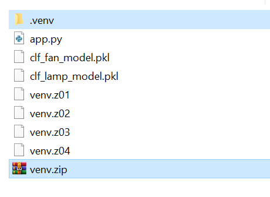

# 👷🛠️Đang cập nhật - bổ sung ....
# Nhóm 3 - Các phương pháp học máy

## App dự đoán Output kiểm soát chuồng trại với cây quyết định 2116976_BuiMinhLien

### Để sử dụng app:
- Cách 1: giải nén môi trường ảo venv đã cài đặt sẵn các thư viện cần thiết như Flask, Scikit learn và pandas trên python 3.12.7 trong file venv.zip

- Cách 2: Cài đặt các thư viện cần thiết
```
pip install Flask pandas scikit-learn
```

