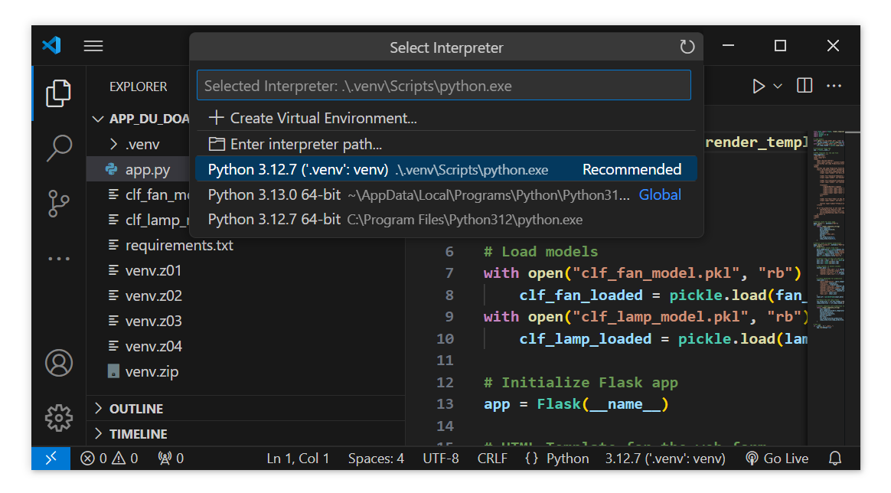

# 👷🛠️ Đang cập nhật - bổ sung ...
# Nhóm 3 - Các phương pháp học máy

## 1. App dự đoán Output kiểm soát chuồng trại với cây quyết định (2116976_BuiMinhLien)

### Hướng dẫn sử dụng ứng dụng:

#### Cách 1: Sử dụng môi trường ảo đã được cài đặt sẵn
1. Giải nén tệp môi trường ảo `venv.zip` đã được cài đặt sẵn các thư viện cần thiết (bao gồm Flask, Scikit-learn và pandas) trong Python 3.12.7. Tệp này nằm tại:
    ```
    2116976_BuiMinhLien_DecisionTree/app_du_doan_output_chuong_trai/venv.zip
    ```
    
    
2. Kích hoạt môi trường ảo.

    

#### Cách 2: Cài đặt các thư viện cần thiết
1. Chạy lệnh sau trong terminal hoặc command prompt:
    ```
    pip install Flask pandas scikit-learn
    ```

#### Kết quả:
- Sau khi chạy ứng dụng ***app.py*** ở **http://127.0.0.1:5000/**, kết quả sẽ được hiển thị như sau:

    


## 2. Phát hiện Đối tượng với Faster R-CNN ResNet50 và Đánh giá Hiệu suất

Bài trên sử  dụng mô hình Faster R-CNN ResNet50 
được huấn luyện trước từ torchvision. Nó có thể phát hiện nhiều loại đối tượng được xác định 
trong tập dữ liệu COCO và bao gồm chức năng để đánh giá hiệu suất của nó trên một tập hợp hình ảnh.

1. Cài đặt thư viện

```
pip install torch torchvision opencv-python numpy matplotlib colorama pandas scikit-learn seaborn
```

2. Sử dụng 
    2.1 bạn có thể xác định dữ liệu của 1 hình ảnh thì hãy sài object
    2.2 nếu bạn muốn sử dụng có 1 file gồm có nhiều hình thì có thể sài mutiobject
    cách sử dụng 
        với đối tượng là 1 búc hình thì đổi đường link ở image_path ở object
        còn đối với đối tượng là 1 folder thì đổi folder_path ở mutiobject
    2.3 sau khi xong hết thì chạy Bài
        chạy xong kết quả sẽ được lưu ở output.csv (tên hình ảnh, nhãn, xác suất, tọa độ hộp giới hạn)
        sau khi chạy xong chuyển qua objectResult để đánh giá kết quả
            + Độ chính xác, Thu hồi, Điểm F1 (macro và micro)
            + Sai số bình phương trung bình (MSE), Sai số bình phương trung bình gốc (RMSE)
            + Ma trận nhầm lẫn
            + Phân phối nhãn (biểu đồ thanh và biểu đồ hình tròn)
            + Phân phối xác suất
            + Đường cong đặc tính hoạt động của máy thu (ROC)


3. Mô hình

Faster R-CNN: Một kiến trúc phát hiện đối tượng phổ biến sử dụng Mạng đề xuất vùng (RPN) để tạo 
đề xuất đối tượng và mạng Fast R-CNN để phân loại và tinh chỉnh các đề xuất.

ResNet50: Mạng nơ-ron tích chập (CNN) với 50 lớp, được sử dụng làm xương sống để trích xuất đặc trưng trong mô hình Faster R-CNN.

Được huấn luyện trước: Mô hình được huấn luyện trước trên tập dữ liệu COCO, cung cấp hiệu suất ban đầu tốt trên nhiều loại đối tượng.

Tổng quan về object Detection
    sài thư viện torch, torchvision, cv2, numpy, pandas, sklearn, v.v.
    Xác định danh sách các danh mục đối tượng từ tập dữ liệu COCO.
    Tải mô hình Faster R-CNN ResNet50 được huấn luyện trước và đặt nó ở chế độ đánh giá.
    Hàm get_predictions: Lọc các dự đoán dựa trên ngưỡng xác suất và tùy chọn là danh sách các đối tượng được chỉ định.
    Xử lý hình ảnh:
        + Lặp lại qua từng hình ảnh trong thư mục được chỉ định.
        + Tải và tiền xử lý hình ảnh.
        + Thực hiện phát hiện đối tượng bằng cách sử dụng mô hình đã tải.
        + Lưu kết quả phát hiện (nhãn, xác suất, hộp giới hạn) vào tệp CSV.
    Đánh giá hiệu suất:
        + Tải dữ liệu từ tệp CSV.
        + Tính toán và in các số liệu hiệu suất khác nhau (độ chính xác, thu hồi, điểm F1, MSE, RMSE).
        + Tạo và hiển thị biểu đồ cho ma trận nhầm lẫn, phân phối nhãn, phân phối xác suất và đường cong ROC.